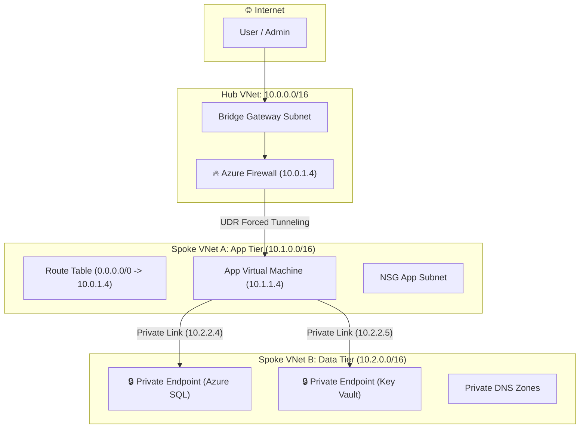

# Zero Trust Network Architecture in Azure: Firewalls, Private Link & NSGs

Enterprise-grade hands-on cloud lab and architecture reference for **Zero Trust Networking in Microsoft Azure**. Master Hub-and-Spoke VNet topologies, Azure Firewall forced tunneling via User Defined Routes (UDR), Private Link / Private Endpoints with disabled public access, and granular NSG micro-segmentation.

---

## 🎯 Architecture Diagram



---

## 📚 Repository Structure

```text
.
├── README.md                          # Main repository documentation & guide
└── src/
    ├── bicep/
    │   └── main.bicep                 # Bicep IaC for Hub-Spoke VNet, Firewall & Private Link
    ├── nsg/
    │   └── nsg-rules.json             # Micro-segmentation NSG & ASG rule definitions
    ├── python/
    │   ├── zero_trust_validator.py    # Python diagnostic script for DNS & port checks
    │   └── requirements.txt           # Python dependencies
    └── app/                           # Interactive React SPA Cloud Lab
        ├── package.json               # Clean setup (no icon dependencies)
        ├── vite.config.ts
        └── src/
            ├── App.tsx                # 3-panel interactive lab interface
            └── index.css
```

---

## 🛠️ Module 1: Hub-and-Spoke VNet & Forced Tunneling

In a Zero Trust network, all outbound traffic from workloads must pass through a central inspection firewall.

### Deploy Bicep IaC Template:
```bash
az deployment group create \
  --resource-group rg-zerotrust-lab \
  --template-file src/bicep/main.bicep
```

---

## 🔒 Module 2: Private Link & Disabled Public PaaS

Disable public network access on Azure SQL and Key Vault instances:

```bash
# Verify public network access is disabled
az sql server show --name sql-zerotrust-prod -g rg-zerotrust-lab --query "publicNetworkAccess"
```

---

## 🛡️ Module 3: Micro-segmentation & Application Security Groups

Apply Network Security Group (NSG) rules to restrict lateral east-west movement between subnets.

---

## 🧪 Module 4: Run Automated Verification Script

```bash
cd src/python
pip install -r requirements.txt
python zero_trust_validator.py
```

---

## 💻 Module 5: Run Interactive Web Lab

```bash
cd src/app
npm install
npm run dev
```
